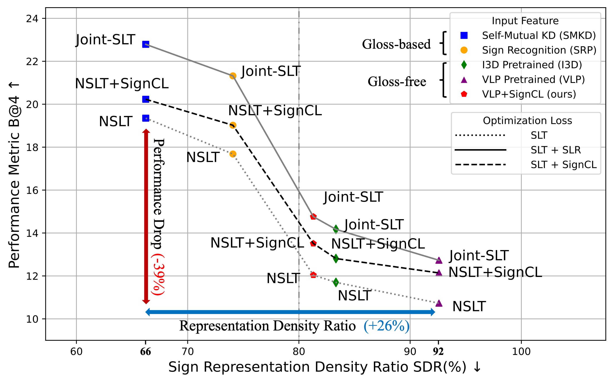

# [SignCL: Improving Gloss-free Sign Language Translation by Reducing Representation Density (NeurIPS'24)](https://arxiv.org/abs/2405.14312)

## Overview
`SignCL` is a PyTorch module designed to enhance sign language translation models by encouraging the learning of more discriminative feature representations. It brings the visual representations of sign gestures with identical semantics closer together while pushing those with different semantics farther apart through contrastive learning. This module can be integrated into both the pretraining and finetuning stages of a sign language translation model. Experiments demonstrate that `SignCL` can significantly reduce representation density and improve performance across various translation frameworks.

<figure>
  
  <!-- <figcaption>
    The GFSLT-VLP model incorrectly translates “钢琴” (piano) as “电脑” (laptop) due to their representations being too close to others. `SignCL` effectively separates the representations of “电脑” (laptop) and “钢琴” (piano) in the feature space, enabling the accurate translation of “钢琴” (piano).
  </figcaption> -->
</figure>

## Representation Density and Performance Drop
We consistently observed a negative
relationship between representation density and performance. Specifically, an increase in the representation density <span style="color:blue;">(+26%)</span> can result in a 
performance drop <span style="color:red;">(-39%)</span> in BLEU score.

<details>
  <summary>Click to see figure!</summary>
<figure>
  
</figure>
</details>


## Installation

To use `SignCL`, ensure you have the following dependencies installed:

- Python 3.x
- PyTorch
- torchvision (optional, for dataset handling)
- Other standard libraries (e.g., random, numpy)
## Checkpoints
Checkpoints can be found in [here](https://drive.google.com/drive/folders/1JdxKylEmoaRpyqCYtb92cYgr2eDbiGJG?usp=sharing)

## Usage
Here's a step-by-step guide to integrating SignCL into your sign language translation model.
```bash
0. cl_criterion = SignCL()
1. frames_feature = model.encoder(src_input)
2. margin = min(20, max(10, int(num_frames // text_length * 2.3)))
3. cl_loss = cl_criterion(frames_feature, margin=margin)
4. total_loss = lambda_ * cl_loss + original_loss
```

### A. Usage example in your framework:

<details>
  <summary>Click to expand!</summary>

```python
import torch
import torch.nn as nn
import torch.optim as optim
from sign_cl import SignCL

# Define the Contrastive Loss Criterion
cl_criterion = SignCL(max_distance=32.0, pos_samples=2, neg_samples=4)

# Assume you have a model, data loader, and other necessary components
model = YourSignLanguageModel()
optimizer = optim.Adam(model.parameters(), lr=0.001)

# Example training loop
for epoch in range(num_epochs):
    for batch in data_loader:
        src_input, text_input = batch['src'], batch['text']
        
        # Forward pass
        frames_feature = model.encoder(src_input)
        num_frames = frames_feature.size(1)
        text_length = len(text_input)  # Assuming text_input is the corresponding text
        margin = min(20, max(10, int(num_frames // text_length * 2.3))*2)
        
        cl_loss = cl_criterion(frames_feature, margin=margin)
        original_loss = ...  # Compute your original loss here
        lambda_ = 0.01  # Weight for the contrastive loss, adjust as necessary
        total_loss = lambda_ * cl_loss + original_loss
        
        # Backward pass and optimization
        optimizer.zero_grad()
        total_loss.backward()
        optimizer.step()
        
        print(f"Epoch [{epoch+1}/{num_epochs}], Loss: {total_loss.item()}")
```

</details>


### B. Usage example for GFSLT-VLP:
This example code was modified from [GFSLT-VLP GitHub](https://github.com/zhoubenjia/GFSLT-VLP). Please refer to their homepage to set up the environment and dataset.

To execute, use the following command:

```sh
bash examples/scripts.sh
```

This script will execute the training and evaluation process, demonstrating how to integrate the `SignCL` loss function into the GFSLT-VLP framework. We also included our self-reproduced `results` and `log.txt` on the CSL-Daily dataset (see [link](examples/GFSLT-VLP/out/0630_GF_SignCL)).

<details>
  <summary>Click to expand results!</summary> 
<figure>
  
  <figcaption>Table 1: Enhancing GFSLT-VLP by reducing representation density on CSL-Daily test set.</figcaption>
</figure>

</details>

## Citation

Note if you find this code work for your research, please cite the following paper:

```bibtex
@inproceedings{ye2024improving,
  title={Improving Gloss-free Sign Language Translation by Reducing Representation Density},
  author={Ye, Jinhui and Wang, Xing and Jiao, Wenxiang and Liang, Junwei and Xiong, Hui},
  journal={arXiv preprint arXiv:2405.14312},
  year={2024}
}
```
